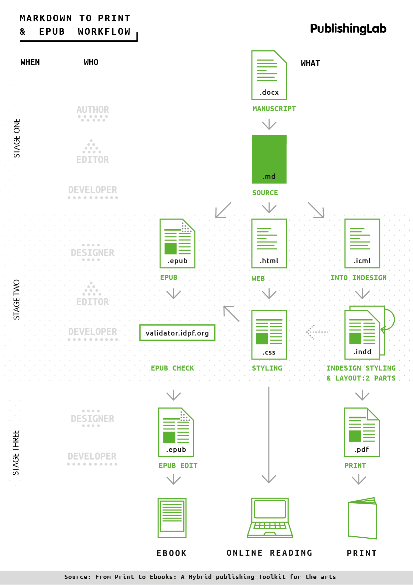

# Common errors icml to InDesign

versions tested: InDD CC, InDD CS6, InDD CS5.5

## cannot apply styles or make manual edits after placing icml

**Translation:**
This is likely because your icml file has not been "checked out" - this means that the incopy file is able to be edited by everyone, but restricts edits to what's already been marked up in the document.
To make manual edits and add images, you need to check out. When saving the file, InDD will ask you to check back in, say yes.

### solution
edit > incopy > checkout (Command+F9)

## when updating the linked icml file, the manual changes & images disappear

**Translation**
This will happen. Manual changes, like fixing widows or orphans, need to be left until the end when the editor has submitted the absolutely final file. For the first design draft, it's important to include images in the correct position in the content, however please note that they will need to be relinked in InDD when you have the final icml file.

### solution
Image frames will have a little crossed pencil icon, double click this to relink to the image.

For the last design, wait until you have the final icml file from the editor so that you can UNLINK your InDD document, finish manual edits and create a .pdf.

### new paragraph styles I created were no longer applied to the text when updating the icml file

**Translation**

The icml files contain markup in the form of headers, paragraphs, blockquotes, footnotes and tables. The editor's role is to assign this markup to the content (md file) before you receive the icml. If you notice there are some headers missing for instance, please inform the editor so he can fix the file. Note: In the case of the author name - which has a special class, you will have to create a paragraph style for author & apply it twice: in the first round and in the final updated InDD file. This should be the only instance of repeated paragraph styling.

### solution
Create the new paragraph styles necessary (ie author name), inform the editor of any un-marked headers, blockquotes etc, and wait for the final icml file. 

### I was working on the InDD file and at some point couldn't make any more manual changes.

**Translation**

The cause of this issue is not clear, however it may be because of an idlk file.
InDesign Lockfile is generated by InDesign as soon as you open an InDD file, this is to prevent someone else opening the same file and making changes simultaneously. It's possible that while you're working on an InDD file, someone else opens it and somehow you are 'locked out'. 

### solution
Move the idlk file to the trash. 

## What do these InDD symbols mean?

globe+arrow: indicate anyone can edit in incopy
crossed pencil: indicates missing link to an image/text, equivalent to the ? icon that indicates missing links

## No styles are attributed to text after I place icml file

**Translation**
This shouldn't happen...
doesn't happen with InDD CC,
does happen with CS5.5

### solution

## when I place the icml, it all looks like default styling

**Translation**
InDesign should automatically create all the Paragraph and Character styles named in the .icml (based on what you had in the HTML, including class names for paragraphs and spans). But in a new InDesign doc, they won't look like anything, so you'll need to spend some time defining the style attributes in the InDesign document.

### solution

Check out the icml file and spend some time defining the style attributes in the paragraph styles panel.

## FAQ: Footnotes: some are long and flow over two pages, but the line above is not the same on both pages.

**Translation**
The inDD template file we provide you with shouldn't show this problem, but it just means the footnote style is only being applied to the first page of the footnote.

### solution
You will need to go Type > Document Footnote options >Layout > Rule above, select the continued footnote options. This means whenever there's a long footnote the same style applies over the page.

## FAQ: Why is there a tmp.icml file in the folder?
**Translation**
A TMP file is just a temporary file that's automatically created as you make a new file, you can safely ignore it.

## FAQ: There's an unassigned icml in my assignments panel, will this affect my workflow?

**Translation**
In InDesign, assignment files are containers for organizing collections of page items. For example, you might want to select all the items in a story (headline, byline, copy, graphics, and captions), and then assign them to one InCopy user. Adding those items to an assignment provides a convenient way for InCopy users to access only the content for which they are responsible. Only InDesign users can create assignment files; only InCopy users can open them.
You will not be assigning items with the HPToolkit Workflow, so it's safe to ignore.

### Solution
We aren't using an InCopy to InDesign workflow, so this will not affect your ability to work on the file. Ignore it. The crossed pencil means the file needs to be accessed via InCopy.
# Common errors md to ePub

## name of error: No rule to make target
**translation**
make: *** No rule to make target `md/Hybrid', needed by `epub'.  Stop.
Translation: I’m expecting a piece of code here that you forgot, most likely some punctuation, like a semi-colon, parentheses, curly bracket, etc.

This error is pretty much always caused by a typo, make sure your file has no spaces in the name.

Incorrect:

Hybrid Publishing Workflow.md

Correct:
Hybrid-Publishing-Workflow.md

----
version: InDD CC

## font problem: italic styles render in iBooks as bold italic

**Translation:**
The styles.epub.css file needs to be customised if you want to apply specific typefaces to your ePub. This means you need to use @font-face as well as listing your fonts in the src:

You also need to add a line of code to your makefile to embedd the fonts into the ePub.
--epub-embed-font=../lib/* \

### solution

The solution consists of 3 parts: make 2 changes to the css + 1 to the makefile.

**css**
incorrect:
@font-face {
src: Open Sans-LightItalic; format('opentype');
}

correct:
@font-face {
  font-family: 'OpenSans-LightItalic';
  font-style: italic;
  font-weight: 300;
  src: local('Open Sans Light Italic'), local('OpenSansLight-Italic'), url(open-sans-v13-latin-300italic.woff) format('woff');
  src: local('Open Sans Light Italic'), local('OpenSansLight-Italic'), url(open-sans-v13-latin-300italic.ttf) format('truetype');
  unicode-range: U+0000-00FF, U+0131, U+0152-0153, U+02C6, U+02DA, U+02DC, U+2000-206F, U+2074, U+20AC, U+2212, U+2215, U+E0FF, U+EFFD, U+F000;
}

incorrect:
not specifying a style for italic

correct:
em {
    font-family: "OpenSans-LightItalic";
    font-style: italic;
}

**make file**
incorrect:

correct:
--epub-embed-font=../lib/* \

## command line - when using pandoc to create epubs

**Translation:**
Pandoc is a converter, 

### solution
a guide to set it up & use it to recreate files

## how to make a border

### solution

## footnotes repeated or not formatted

**Translation**

### solution
??

## Fonts
Optional fonts:

    lib/ - folder for storing custom fonts, that will be used in the EPUB

Note on the use of custom fonts: If you choose to use fonts, make sure to change the makefile to include the use of fonts in the makefile epub rule, such as in the rule bellow, where --epub-embed-font=lib/UbuntuMono-B.ttf \ was added to allow for the use of the Ubuntu Mono font. Also include the font on th EPUB style-sheet with @font-face rule

## Fonts not rendering
**Translation**
Instead of seeing the custom font I've chosen for the book, I see a default. You need to reference the fonts you use in the .css file and in the makefile - the line below tells the makefile to embed this font in the ePub file.

### solution
Check your makefile under **epub:** section you need to include
--epub-embed-font=../lib/* \

## My book is called 'Main Title'
**Translation**
You need to update the metadata.xml file so that your ePub has the right title, author, isbn and other important info related to it. This is a good indicator it hasn't been updated and is showing the default placeholder text.

### solution
Open the metadata.xml file inside the epub folder and update the details. You can find a more info about metadata here: <a href="http://www.publishinglab.nl/blog/2015/09/25/metadata-schmetadata-whats-it-good-for/">http://www.publishinglab.nl/blog/2015/09/25/metadata-schmetadata-whats-it-good-for/</a>

# Hybrid Publishing Toolkit Workflow for Print & ePub

Diagram for visual explanation of the process.

This workflow applies to all books produced by PublishingLab, including the KnowledgeMile series. 
Note: the Theory on Demand publications have an InDesign template file (.indt) + font files included so that it is quicker for a designer to style content and create a .pdf.
 
The KnowledgeMile and other series may require a more custom approach to the design.

GitHub is also an important part of the workflow, it allows versions and progress of the book to be tracked and archived.

Credit: The greater part of this framework was developed as part of the Digital Publishing Toolkit by Michael Murtaught, with the support of Institute for Network Cultures and Creating 010.

# icml to InDD Workflow explained

This is the process, it has 2 stages: the initial stage sets the book up and results in a pdf that can have a final checked done by the editor.

The final stage is where the icml can be unlinked and manual changes made to finish the book.

## To begin

The Hybrid Publishing Workflow uses markdown and Pandoc to create multiple outputs. A developer (or editor) will convert the author's Word documents to markdown, make changes and then supply the editor with an icml file. Icml files are Adobe inCopy files that are read by inDD. This means designers don't have to refer to a pdf or Word Document to know how the document is marked up.

### Where the designer comes in
The designer is involved once the editor has finished marking up and editing the text. Of course, nothing is perfect, which is why there is a final check (and update) before the last icml is sent, which the designer will update and can unlink.

To be able to do this final check, the pdf is needed.

##icml to InDD

1. Open a new document in InDD (or a template .indt file if it has been provided) and file > place the icml(s).
Don't be alarmed if all the text is set in minion pro (or some default font), it looks like this because the icml can tell InDD to define the styles of the text (which parts are headers etc.), but not do the actual design work. 

2. Check the paragraph & character styles panel to see that the styles have been created and are applied correctly.
3. To make changes, checkout your icml file, go to Edit > InCopy > Checkout
4. Define styles, place images, create a cover, but do not start making manual changes (like fixing widows or adding custom spacing)
5. Once everything is in the book (all images, diagrams) and the styles are correct, export a .pdf for the editor to do a final check.
6. The editor checks, corrects & a new icml file is created and sent to the designer.
7. Relink the icml file - your paragraph changes should remain, but it is likely you will need to relink images. Now that you have the final icml (make sure the editor has confirmed that you do). You can unlink from the icml and finish manual changes.
8. Done - export the final .pdf

See the <a href="">FAQs</a> to find answers to common errors.

Success!

# md to ePub
The instructions can be found here on
<a href="https://github.com/DigitalPublishingToolkit/Hybrid-Publishing-Resources/wiki/From-Manuscript-to-EPUB">GitHub</a>

**ePub styles**
For TOD, you can access the style.epub.css file here:
there are options for tables,
adding a border around text 
you can remove the comments to apply styles.
update the hex (ie #FFFFFF) color values throughout the .css file to match the newest colors chosen in the print book.

## Glossary
markup: a system for annotating a document in a way that is syntactically distinguishable from the text. An example of this is in html is h1 for the most important heading, and # - a pound symbol to indicate a heading 1 in markdown. Authors or Editors can markup documents in Word or markdown.

markdown: is a lightweight markup language with plain text formatting syntax designed so that it can be converted to HTML, icml and many other formats.

InCopy: a professional word processor made by Adobe. InCopy lets copywriters and editors style text, track changes and make simple layout modifications to a document while designers work on the same document simultaneously in InDesign — all without overwriting each other's contributions.

icml: An ICML file is an InCopy Document by Adobe, it is XML-based.

idlk: InDesign Lock file it, indicates that a file is in use.

ePub: 
